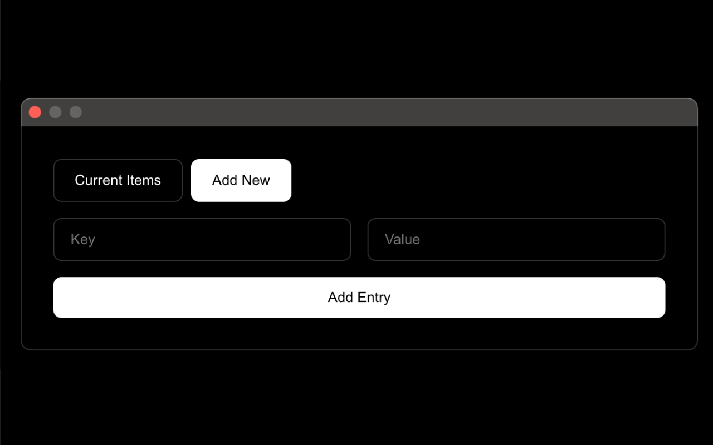
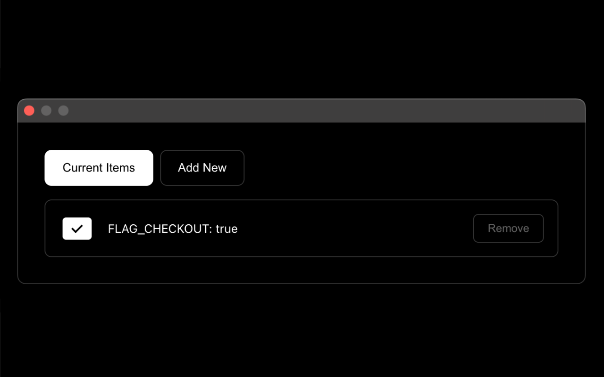

## Screenshots

    

        
        
    

## Features

A Chrome extension that helps you manage localStorage items with a simple interface. 

Easily switch localStorage entries on and off across your browsing sessions.

- Add key-value pairs to localStorage
- Toggle localStorage entries on/off with a simple switch
- Clean and intuitive user interface
- Persistent storage of your entries
- Easy to use checkbox system

## Usage

1. Click the StorageSwitch icon in your Chrome toolbar
2. Add new entries using the "Add New Entry" form
3. Toggle entries on/off using the checkboxes
4. Delete entries using the remove button

## License

MIT License
